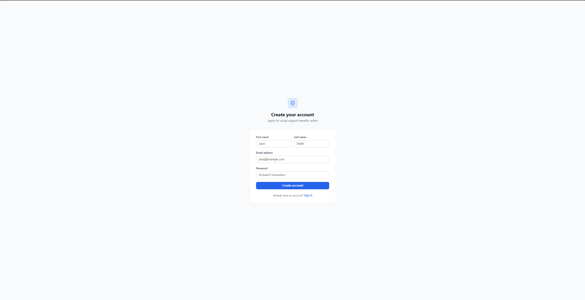
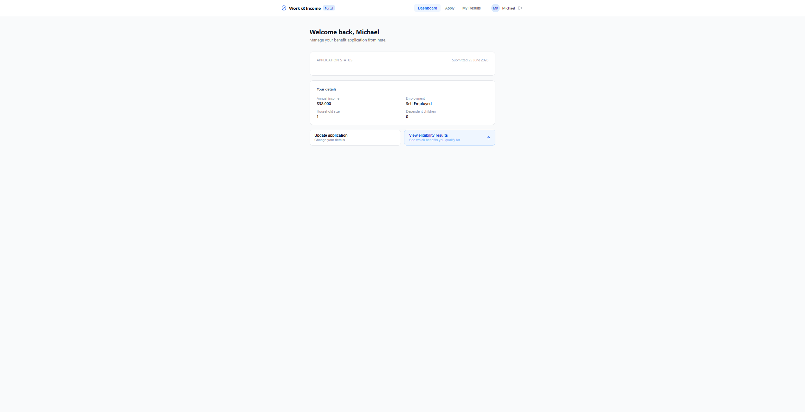
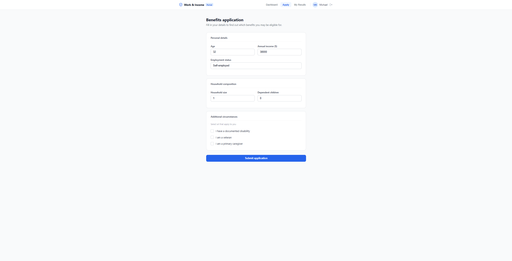
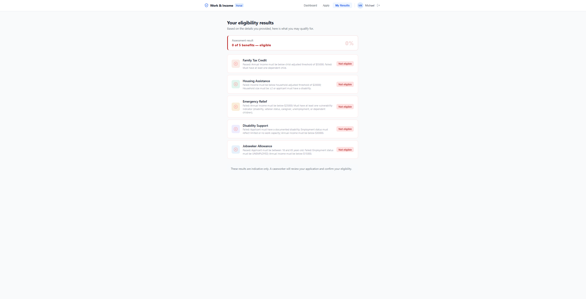
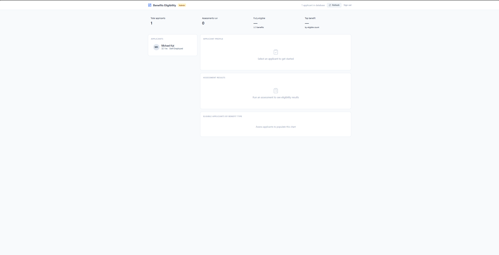
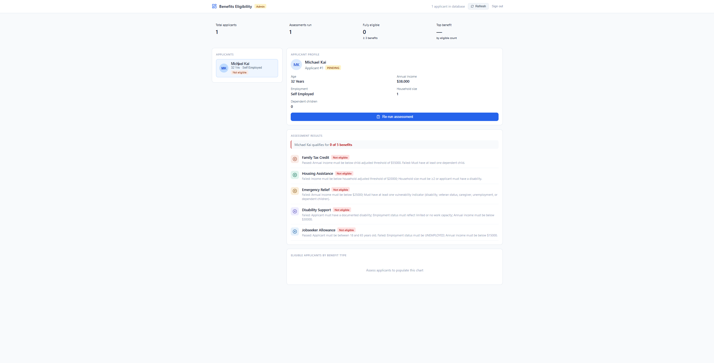

# Benefits Eligibility System

A full-stack social welfare eligibility platform modelled on government benefit 
management systems (MSD/WINZ SWIFTT), built with Java Spring Boot, React TypeScript, 
PostgreSQL, Docker, and GitHub Actions CI/CD.

---

## Architecture

| App | Stack | Port |
|---|---|---|
| `backend/` | Java Spring Boot + PostgreSQL | 8080 |
| `user-portal/` | React + TypeScript | 3000 |
| `admin-portal/` | React + TypeScript | 3001 |

---

## Screenshots

### User Portal

**Sign up**

**Sign in**

**User Profile**

**Benefit Application Form**

**Eligibility Results**

---

### Admin Portal

**Admin Login**

**Applicant Dashboard**

**Running an Assessment**

---

## Running locally

### 1. Start backend + database
\`\`\`bash
cd backend
docker compose up --build
\`\`\`

### 2. Start user portal
\`\`\`bash
cd user-portal && npm install && npm start
\`\`\`

### 3. Start admin portal
\`\`\`bash
cd admin-portal && npm install && npm start
\`\`\`

---

## Seeded accounts

| Role | Email | Password |
|---|---|---|
| Admin | admin@winz.govt.nz | Admin@1234 |
| Admin | caseworker@winz.govt.nz | Admin@1234 |
| User | maria.santos@example.com | User@1234 |
| User | james.okafor@example.com | User@1234 |

---

## Key technical highlights

- **Strategy + Chain of Responsibility** patterns for composable eligibility rules across 5 benefit types
- **JWT authentication** with Spring Security, role-based access control, BCrypt password hashing
- **Multi-stage Dockerfile** with non-root runtime user; Docker Compose orchestration
- **GitHub Actions CI/CD** — build, test, Docker image verification on every PR
- **JUnit 5 + Mockito** unit and integration tests; H2 in-memory DB for test isolation
- **Idempotent data seeder** — admin accounts and mock applicants on first startup